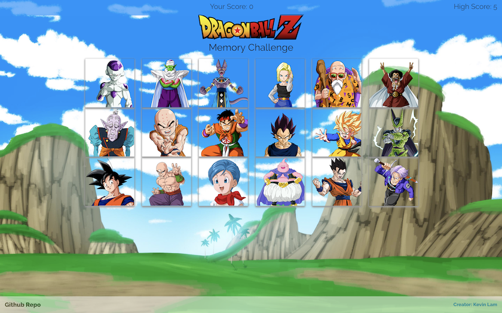

# React Memory Game

### Overview
This project was bootstrapped with [Create React App](https://github.com/facebook/create-react-app). User will be given different characters on the screen. The objective is the user has to select all the available characters without repeating. There is a high score that the player can try to beat.

You can check out the here
[Live Demo](https://kdublam.github.io/clicky-game/)!

### Screenshots

#### Desktop page

#### Mobile page

## Getting Started

### Available Scripts

In the project directory, you can run:

### `npm start`

Runs the app in the development mode. 
Open [http://localhost:3000](http://localhost:3000) to view it in the browser.

The page will reload if you make edits. 
You will also see any lint errors in the console.

### `npm test`

Launches the test runner in the interactive watch mode. 
See the section about [running tests](https://facebook.github.io/create-react-app/docs/running-tests) for more information.

### `npm run build`

Builds the app for production to the `build` folder. 
It correctly bundles React in production mode and optimizes the build for the best performance.

The build is minified and the filenames include the hashes. 
Your app is ready to be deployed!

See the section about [deployment](https://facebook.github.io/create-react-app/docs/deployment) for more information.

## Deployment

See how you can deploy this React app [here](https://github.com/gitname/react-gh-pages)

